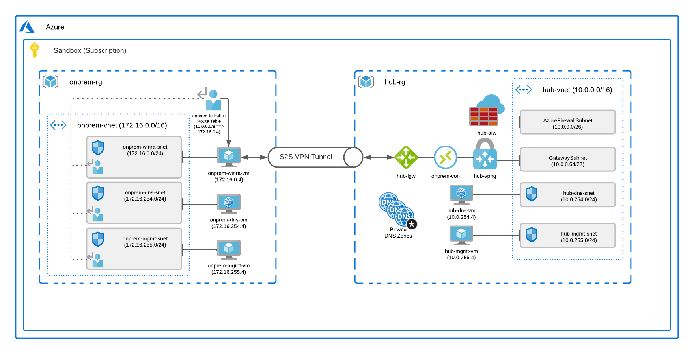

# azure-hybridnet-terraform

## Overview

Do you want to level up your understanding of hybrid networking with Azure?  Have you mastered Terraform basics?

**If you answered "yes", then this repo is for you.**

Designing a hybrid network architecture that seamlessly integrates on-premises networks with Azure can be a big obstacle for enterprises moving to the cloud.  Even after a working architecture is in place, software engineers and IT professionals who aren't steeped in Azure networking can struggle to understand fundamental concepts.  Add to that, even those who are passionate about learning usually don't have a data center in their home basements or hardware-based VPN appliances sitting under their desks.  So, experimenting with the on-premises components of the hybrid network can be a little tricky.

This repo aims to create a lab or sandbox environment for experimenting with hybrid networks in Azure. It contains Terraform modules for building a basic hub-and-spoke network with a *simulated* on-premises network.  The Architecture section explains the simulated network and details about the setup.

## A Word of Caution

**RUNNING THE TERRAFORM MODULES IN THIS REPO WILL DEPLOY AZURE RESOURCES THAT COST REAL MONEY. BE ESPECIALLY MINDFUL OF THE AZURE FIREWALL RESOURCE IF IT IS ENABLED, AS IT COSTS $1.25 (USD) PER HOUR PLUS DATA TRANSFER COST AS OF WHEN THIS SENTENCE WAS TYPED. SETTING A SUBSCRIPTION LEVEL BUDGET AND EMAIL NOTIFICATION IS STRONGLY ADVISED WHEN USING THE MODULES IN THIS REPOSITORY.**

## Prerequisites

- [Azure account](https://docs.microsoft.com/en-us/dotnet/azure/create-azure-account) 
- [Terraform](https://www.terraform.io/downloads)
- [git](https://git-scm.com/downloads)
- [terraform-docs](https://terraform-docs.io/)  (required only for contributors)

## Modules

Note: Many modules include a management VM for easy SSH access.

|Name|Description
|-|-|
|```hub```|Hub network, private DNS zones, DNS forwarder VM, optional VPN gateway, and optional Firewall *(coming soon)*.  Integrates with ```onprem``` module.
|```landing-zone```|Foundation on which to deploy an application workload. Includes resource group, spoke vnet, subnets configured with NSG's, and management VM.
|```onprem```|Simulated on-premises network with DNS VM and Windows Remote Access VM for configuring Site-to-Site (VPN) to hub network. Integrates with ```hub``` and ```s2s-winras-vpn``` modules.
|```s2s-winras-vpn```|Virtual machine extension intended for Windows Remote Access Services VM in ```onprem``` module. Executes PowerShell script that configures S2S VPN connection to Azure VPN gateway in ```hub``` module.
|```virtual-machine-linux```|Simplifies creating a vnet-connected Linux virtual machine by requiring only a resource group name and subnet id as input parameters.
|```virtual-machine-windows```|Simplifies creating a vnet-connected Windows virtual machine by requiring only a resource group name, subnet id, and admin password as input parameters.

## Architecture

The diagram below depicts the deployed ```hub```, ```onprem```, and ```s2s-winras-vpn``` modules. 



### Virtual Networks

The architecture has several virtual networks. The simulated on-premises virtual network (```onprem-vnet```) uses a disinctly different IP range from the hub (```hub-vnet```) to simplify distinguishing the networks. For spoke networks, the second octet of the IP space corresponds to the landing zone spoke number "N", which can be specified as an input parameter for the ```landing-zone``` Terraform module.

|Virtual network name|Address Space|Description
|-|-|-|
|```onprem-vnet```|172.16.0.0/16|Simulated on-premises network.  
|```hub-vnet```|10.0.0.0/16|Hub virtual network.
|```lzN-vnet```|10.N.0.0/16|Landing zone spoke virtual networks. (N = spoke number)

#### Subnets

 For convenience, DNS subnets (both hub and onprem) follow a x.x.254.0/24 pattern, so it's easy to remember that DNS servers are on the 254 subnet. Similarly the x.x.255.0/24 subnets are for "management", and each has an attached management VM that's intended mostly for connectivity testing between vnets.

|Subnet (onprem-vnet)|Address Prefix|Description|
|-|-|-|
|```onprem-winra-snet```|172.16.0.0/24|On-premises Windows Remote Access & Routing Services subnet.
|```onprem-dns-snet```|172.16.254.0/24|On-premises DNS server subnet.
|```onprem-mgmt-snet```|172.16.255.0/24|On-premises management server subnet.

|Subnet (hub-vnet)|Address Prefix|Description|
|-|-|-|
|```AzureFirewallSubnet```*|10.0.0.0/26|Azure Firewall subnet.
|```GatewaySubnet```*|10.0.0.64/27|Azure VPN Gateway subnet.
|```hub-dns-snet```|10.0.254.0/24|Hub DNS server subnet.
|```hub-mgmt-snet```|10.0.255.0/24|Hub management server subnet.

###### *Microsoft requires these names and sizes for the firewall and VPN gateway subnets.
<br>

### Gateways & Site-to-Site (S2S) VPN

The simulated on-premises network (```onprem-vnet```) is just another Azure virtual network.  Unlike typical connections between Azure vnets that use network peering, the on-premises network connects to the hub (```hub-vnet```) via a Site-to-Site (S2S) VPN connection, which mimcs how many enterprise data centers connect to Azure.  Our S2S setup uses Windows Remote Access and Routing Services (RAS) on Windows Server, which is one of few software VPN's that Microsoft [officially supports](https://docs.microsoft.com/en-us/azure/vpn-gateway/vpn-gateway-about-vpn-devices) for creating connections to Azure VPN Gateway.  **IP forwarding MUST be enabled on the Windows machine so that it can route traffic to and from the VPN.**

### Private Link Services and Private Endpoints   

A *private link-enabled* Azure service is one that supports *private endpoints* - a mechanism for assigning private IP addresses to specific types of PaaS resources, such as a storage accounts or key vaults.  The private IP's, however,  are *endpoints*, meaning that they only permit inbound traffic.  As a side note, Network Security Groups (NSG's) have historically not applied to private endpoints, but a [public preview feature](https://azure.microsoft.com/en-us/updates/public-preview-of-private-link-network-security-group-support/) now supports this functionality.  DNS resolution for private endpoints happens through *Private DNS Zones*, which is covered in the next section.

### DNS

The DNS setup for hybrid networking in Azure can be quite elaborate.  There are four key components:

|Component|Name|IP Address
|-|-|-|
|On-premises DNS server VM|```onprem-dns-vm```|```172.16.254.4```
|Private DNS Server VM|```hub-dns-vm```|```10.0.254.4```
|Azure Public DNS server|(n/a)|```168.63.129.16```
|Private DNS Zones|Various*|(n/a)

###### *Private DNS Zone examples: privatelink.blob.core.windows.net, privatelink.vaultcore.azure.net

In our architecture, DNS lookups for on-premises hostnames originating from on-premises hosts are resolved via the on-premises DNS server (```onprem-dns-vm```).  Lookups for Fully Qualified Domain Names (FQDN's) associated with private link-enabled Azure services originating from the on-premises network (```onprem-vnet```) are forwarded to the private DNS server in the hub network (```hub-dns-vm```), which in turn forwards the request to Azure's public DNS server (```168.63.129.16```).  The public server determines if the request is originating from a network that has a private DNS zone corresponding to the requested DNS record.  For example, if the lookup is for foo.blob.core.windows.net (storage account blob endpoint), then it looks to see if the originating network (```hub-vnet```) has a link to a private DNS zone named ```privatelink.blob.core.windows.net```. If a private DNS zone exists (which it does in our setup), then the public server attempts to find the requested DNS record in that zone and sends it in a reply to the originating DNS server (```hub-dns-vm```), which then passes it back to the on-premises DNS server (```onprem-dns-vm```).  Note that the "link" between a virtual network and a privte DNS zone is not a network link - it's just a logical association made in the vnet resource, much like assocating an NSG with a subnet.  In our setup, the hub vnet (```hub-vnet```) and all spoke vnets are configured to use our private DNS server (```hub-dns-vm```).  Lookups for Azure resources originating from hub or spoke networks follow the same logic as lookups forwarded to our private DNS server (```hub-dns-vm```) from on-premises.  The private server forwards lookups for on-premises originiating from the hub or spokes to the on-premises server (```onnprem-dns-vm```), which resolves the request and replies with the result.
